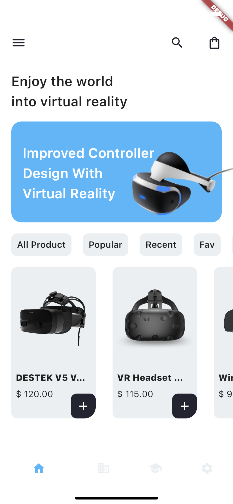

# Virtual Reality Store App



## Getting Started
This a fluttet mobile application UI. that create for Virtual Reality Store. The app code is preloaded with some basic widgets and basic architecture. 


## How to Use 

**Step 1:**

Download or clone this repo by using the link below:

```
https://github.com/Sherange/flutter_vr_app.git
```

**Step 2:**

Go to project root and execute the following command in console to get the required dependencies: 

```
flutter pub get 
```

**Step 3:**

Execute the following command to run project in android:

```
flutter run android
```

## App Features:


* Home Page
* Product Detail Screen
* Theme

### Libraries & Tools Used

* [Flutter Http](https://pub.dev/packages/http)
* [Sliding Up Panel](https://pub.dev/packages/sliding_up_panel)

### Folder Structure
Here is the core folder structure which flutter provides.

```
flutter-app/
|- android
|- assets
|- build
|- ios
|- lib
|- test
```

Here is the folder structure we have been using in this project

```
lib/
|- models/
|- screens/
|- main.dart
|- constants/
|- services/
```

Now, lets dive into the lib folder which has the main code for the application.

```
1 models 
  - Contains the data models of application example Project list and Recommendations data. 
2 screens 
  — Contains the common widgets for your applications. For example, Home, Product detail Screen etc.
3 main.dart 
  - This is the starting point of the application. All the application level configurations are defined in this file i.e, theme, title
4 constants.dart 
  - All the application level constants are defined in this file. contains the constants for `theme`, `api urls`, `preferences` and `strings`
```


### SCREENS

This directory contains all the ui of your application. Each screen is located in a separate folder making it easy to combine group of files related to that particular screen. All the screen specific widgets will be placed in `components` directory as shown in the example below:

```
screens/
|- home
   |- home_screen.dart
   |- components
      |- product_item.dart
      |- product_list_view.dart
```

### Main

This is the starting point of the application. All the application level configurations and app routes are defined in this file i.e, theme, routes, title, orientation etc.

```dart
import 'package:flutter/material.dart';
import 'package:vr_app/constants/theme.dart';
import 'package:vr_app/screens/product_detail/product_detail_screen.dart';
import 'screens/home/home_screen.dart';

void main() {
  runApp(const MyApp());
}

class MyApp extends StatelessWidget {
  const MyApp({Key? key}) : super(key: key);

  @override
  Widget build(BuildContext context) {
    return MaterialApp(
      title: 'Mobile App - Virtual Reality Store',
      routes: {
        '/': (context) => const HomeScreen(),
        '/detail': (context) => const ProductDetailScreen(),
      },
      theme: ThemeData.light().copyWith(
          splashColor: Colors.transparent,
          primaryColor: primaryColor,
          scaffoldBackgroundColor: bgColor),
      initialRoute: '/',
    );
  }
}
```

### RESOURCES

UI - https://dribbble.com/shots/16139957-Mobile-App-Virtual-Reality